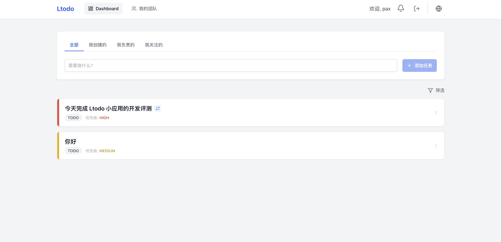
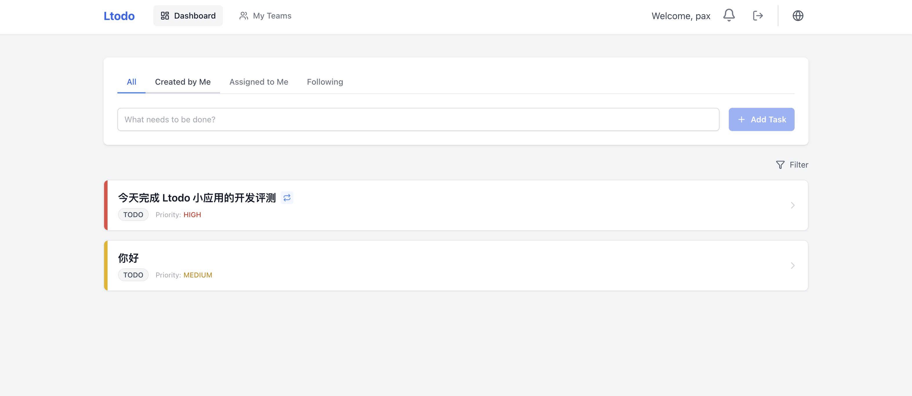
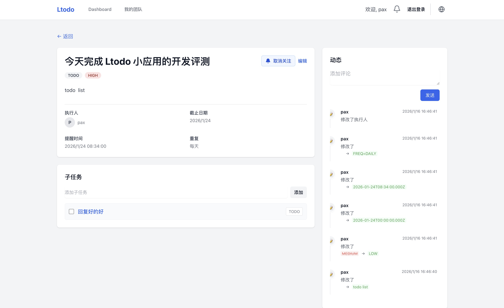
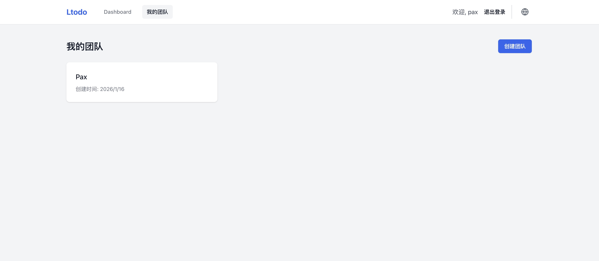
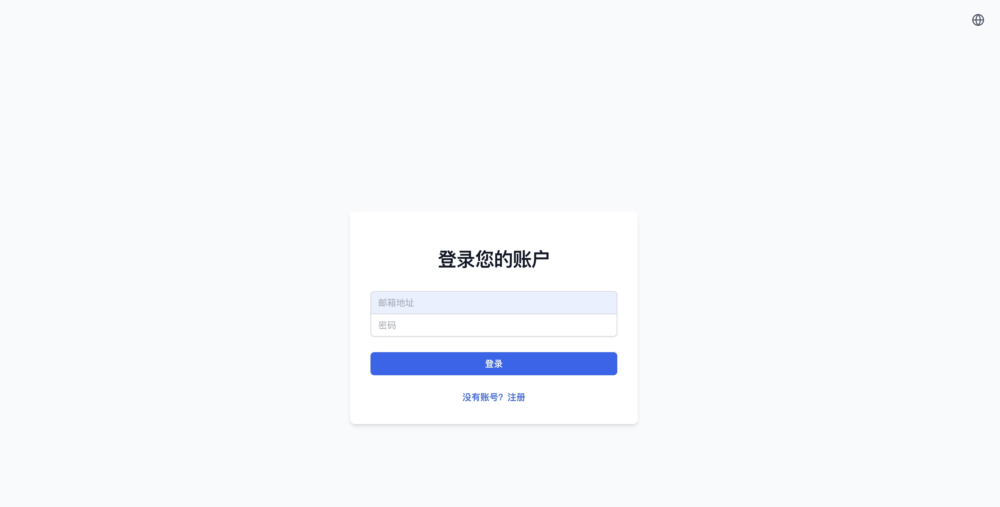

# LTodos (待办事项)

<div align="center">


</div>

基于 NestJS 和 React 构建的现代化全栈待办事项应用。支持多语言、团队协作和实时通知。

## ✨ 功能特性

- 🌐 **多语言支持**: 完整支持中文和英文界面切换。
- 🔐 **用户认证**: 安全的注册和 JWT 登录机制。
- 📋 **任务管理**: 创建、更新、删除任务，支持子任务、优先级和状态流转。
- 👥 **团队协作**: 创建团队、邀请成员，在团队内高效协作。
- 📜 **历史追踪**: 详细记录任务的所有变更历史。
- ⏰ **智能提醒**: 支持任务截止提醒及重复任务规则 (Daily/Weekly/etc)。
- 🐳 **容器化**: 提供完整的 Docker 和 Docker Compose 部署方案。

## 📸 应用截图

### 仪表盘 (Dashboard)

直观展示任务列表，支持筛选和快速创建。
| 中文界面 | English UI |
| :---: | :---: |
|  |  |

### 任务详情 (Task Details)

查看任务细节、子任务、评论及变更历史。


### 团队管理 (Teams) & 登录 (Login)

|         团队管理         |         用户登录         |
| :----------------------: | :----------------------: |
|  |  |

## 🛠 技术栈

- **前端**: React 18, TypeScript, Tailwind CSS, Zustand, Axios, i18next
- **后端**: NestJS, TypeORM, PostgreSQL, Passport (JWT), Swagger
- **基础设施**: Docker, Docker Compose

## 🚀 快速开始

### 前置要求

- Node.js (v18+)
- Docker & Docker Compose
- pnpm

### 开发环境设置

1. **启动数据库**:

   ```bash
   docker-compose up -d postgres
   ```

2. **后端设置**:

   ```bash
   cd backend
   pnpm install
   pnpm start:dev
   ```

   后端 API 将运行在 `http://localhost:3000`。
   API 文档 (Swagger) 可访问 `http://localhost:3000/api`。

3. **前端设置**:
   ```bash
   cd frontend
   pnpm install
   pnpm dev
   ```
   前端应用将运行在 `http://localhost:5173`。

### 部署

使用 Docker 部署完整技术栈：

```bash
docker-compose up --build -d
```

- 前端访问地址: `http://127.0.0.1:8080`
- 后端访问地址: `http://127.0.0.1:3000/api`

## 📚 API 文档

请访问 `http://127.0.0.1:3000/api/docs` 查看交互式 Swagger 文档。
